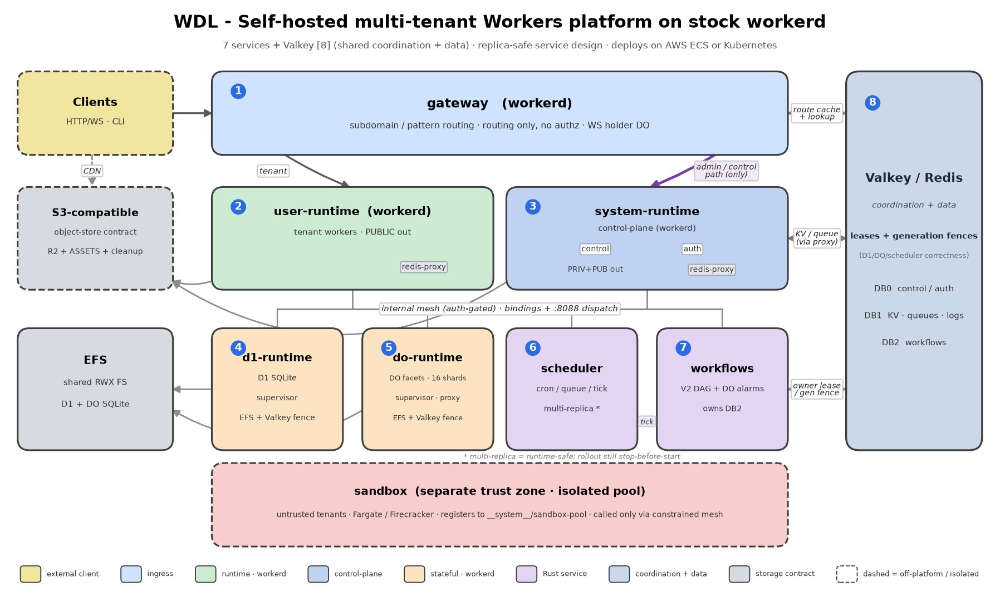

# WDL

[](https://github.com/wdl-dev/wdl/actions/workflows/ci.yml)
[](https://github.com/wdl-dev/wdl/actions/workflows/release.yml)
[](https://hub.docker.com/r/getwdl/wdl-workerd)
[](https://hub.docker.com/r/getwdl/wdl-rust)
[](LICENSE)

> English version: [README.md](README.md)

WDL 是基于 stock Cloudflare workerd、具备多副本故障切换能力的自托管多租户 Workers 平台。它通过 workerd 的 `workerLoader` API，从 Redis/Valkey 动态加载不可变 Worker 版本，并在 runtime 外侧补齐 control/auth、KV、R2、D1、Durable Objects、queues、cron、Workflows、ASSETS、service/platform bindings、实时日志 tail、Prometheus metrics，以及部署与生命周期工具。项目名最初来自 “workerd dynamic loader”；现在平台能力已经远超动态加载本身，产品名保留为 WDL。

## 提供的能力

- 按 namespace 子域名和自定义 host pattern 进行多租户路由。
- 不可变 Worker version，显式 promote/rollback，以及硬删除 lifecycle API。
- 通过 `wdl` CLI 部署 Wrangler 项目。
- KV、R2、D1、Durable Objects、queues、cron triggers、Workflows、ASSETS、service bindings 和 platform bindings。
- secret 写入 Redis 前进行 at-rest envelope encryption。
- 基于有界 Redis stream 的 live `wdl tail`、结构化日志和 Prometheus metrics。
- D1/Durable Objects 具备明确 failover 语义，runtime、scheduler 和 Workflows 具备多副本安全的 dispatch 路径。
- 本地 Docker Compose stack，以及 production-shaped Terraform / Kubernetes 交付路径。

## 为什么是 WDL

workerd 是 runtime，不是 platform。它负责执行 Workers，但不包含运营一个 Workers platform 所需的多租户路由、状态、存储、调度、secret、control API 和生命周期管理。WDL 补齐的就是这一层。

WDL 围绕 stock workerd 构建，不 fork workerd。Upstream workerd 仍是 runtime contract；WDL 通过 workerd config、静态 system worker、Rust service、Redis/Valkey state machine 和 S3-compatible object storage 来表达 platform。Operator 可以保留 Workers programming model，继承 upstream workerd 修复，而不是维护 runtime fork。

WDL 也不只是 demo stack。它的 control plane、routing、stateful binding ownership、dispatch worker、observability、release image 和 infrastructure path 都按单区域生产平台组件实现。这里的 production-ready 指平台具备明确 recovery contract、私有 mesh boundary、release gate，以及可部署的 Terraform/Kubernetes shape；operator 仍然负责容量规划、managed Redis/Valkey、storage durability、ingress protection 和区域级灾备。

## WDL 不是什么

- **不是全球边缘网络。** WDL 运行在你自己运维的单区域基础设施上。它不是 Cloudflare 的 global edge、anycast network 或 point-of-presence fabric，也不提供 network-layer DDoS protection。这个取舍让 WDL 可以提供 strongly consistent KV 和 read-your-writes D1。
- **不是 Cloudflare Workers 的完全替代品。** 兼容性逐 surface 追踪为更强、不同或未实现，见 [compatibility matrix](docs/compatibility.zh.md)。

## 适合谁

- 希望在自有基础设施上使用 Workers programming model 和 Wrangler workflow 的团队。
- 想给内部开发者提供多租户 Workers platform 的平台团队。
- 有 data residency、sovereignty、compliance 或 air-gapped 要求，必须运行在自有 infrastructure 上的环境。
- 已经采用 Workers model、并希望在自有 infrastructure 上部署而不重写 application model 的 workload。

## 与 Cloudflare Workers 的关系

**WDL 与 Cloudflare, Inc. 没有关联、背书或赞助关系。Cloudflare、Cloudflare Workers、Wrangler 和 workerd 是 Cloudflare, Inc. 的商标或注册商标。**

你编写标准 module worker（`export default { fetch }`），使用普通 `wrangler.toml` 或 `wrangler.jsonc`，并 pin 到 Wrangler 4。`wdl deploy` 只运行 `wrangler deploy --dry-run` 做本地 bundling；不会向 Cloudflare 发送任何内容。不要对 WDL platform 使用 `wrangler deploy`，发布应走 `wdl deploy`。

Worker 在 platform domain 上以 path-prefixed URL 访问：

```text
https://<namespace>.<platform-domain>/<worker-name>/<path>
```

Worker 看到的 request path 会去掉 `/<worker-name>` 前缀。

兼容性差异分为三类：更强、不同、未实现。WDL 也增加 platform bindings 等 platform-owned capability。逐 surface 状态见 [compatibility matrix](docs/compatibility.zh.md)。

## 托管平台预览

WDL 首先是基础设施项目：operator 运行自己的 platform，tenant 用 `wdl` CLI 部署。WDL Team 可能会运行一个实验性托管预览环境，control plane 在 `api.wdl.dev`，worker 入口是 `*.wdl.sh`，仅用于展示 WDL 能力，并运行 WDL 自己的 workload。它不是产品化公开平台，目前尚未上线；如果想参与测试，可以发邮件到 <hi@wdl.dev>。

## 架构摘要



平台拆成七个 app service 和共享状态：

| Service | 角色 |
|---|---|
| `gateway` | public/control ingress、host routing、自定义 pattern routing、WebSocket holder path。 |
| `user-runtime` | tenant worker runtime pool、public-only outbound、本地 redis-proxy sidecar。 |
| `system-runtime` | control/auth/static system worker 和特权 `__system__` runtime pool。 |
| `d1-runtime` | D1 SQLite execution，使用 owner lease 和 supervisor 管理 workerd process。 |
| `do-runtime` | Durable Object native facet、SQLite storage、alarm、owner lease 和 WebSocket。 |
| `scheduler` | cron、queue 和 workflow tick dispatch。 |
| `workflows` | Workflows V2 state machine、DB 2 owner 和 DO alarm delivery backend。 |

Valkey/Redis 使用明确的逻辑切分：

- DB 0：control metadata、bundle、route、auth、lifecycle、D1/DO owner state、workflow definition。
- DB 1：data-plane KV、queue stream、delayed queue、orphan stream、log-tail stream。
- DB 2：workflow instance state、step record、ready/due shard、event、run lease。

S3-compatible storage 承载 ASSETS 和 R2。D1 和 Durable Object SQLite 文件使用 workerd `localDisk`。在 production-shaped 环境里，这些会映射到 managed 或 provisioned storage；本地 compose 使用 volume 和 `s3mock`。

### 高可用与故障切换

WDL 的 HA 模型是单区域、基于 service replica 的模型。Gateway、runtime pool、scheduler、workflows、D1 runtime 和 DO runtime 是独立的 service family；只要模块并发合同允许，operator 可以运行多个 task 或 pod。Tenant worker version 是 immutable，并按 id 加载，所以替换 runtime replica 不会改变 routing state。

Stateful binding 不把 service discovery target 直接当作 owner，而是使用 ownership protocol。D1 ownership 按 physical database 划分；Durable Object ownership 按 owner scope 划分。两者的 owner record 都带 task identity、lease expiry 和 monotonic generation fence，因此旧 replica 在 takeover 后会 fail closed。Supervisor 在 rollout 时 drain 本地 D1/DO owner；普通 task 丢失则通过 lease expiry 让其他 replica takeover。Scheduler projection 是可修复的，queue 是 at-least-once，cron/queue dispatch 路径具备多副本安全性，Workflows 用 DB 2 lease 和 generation/run-token fence 推进 execution。Scheduler rollout 仍可能产生短暂 dispatch gap；missed cron slot 遵循已文档化的 best-effort cron 语义，不会回放。

完整架构见 [docs/architecture.zh.md](docs/architecture.zh.md)。

## 快速开始

先安装 standalone `wdl` CLI，再安装仓库依赖、编译本地 workerd configs、用已发布的 Docker Hub images 启动 stack，并部署一个 smoke worker。Fresh clone 必须先编译，因为 compose 会把宿主机 `./dist` bind mount 到容器里，遮住镜像内 build 出来的 configs。

```bash
npm install -g @wdl-dev/cli@1.4.0
npm ci
npm install --ignore-scripts --prefix test-workers/hello-jsonc
npm run compile:workerd:local
docker compose -f docker-compose.yml -f docker-compose.images.yml up -d --pull always --no-build
export ADMIN_TOKEN=local-dev-token
export CONTROL_URL=http://admin.test:8080
export CONTROL_CONNECT_HOST=localhost

wdl deploy test-workers/hello-jsonc --ns demo
```

通过 gateway 调 tenant worker：

```bash
curl -H "Host: demo.workers.local" "http://localhost:8080/hello-jsonc/"
```

通过 CLI 查看 namespace：

```bash
wdl workers --ns demo
```

这会返回该 namespace 的 worker 列表，结果里应能看到 active worker 是 `hello-jsonc`。

control URL 的 host 必须放在 `PLATFORM_DOMAIN` 外面；gateway 用这个 host 直接短路到静态 control worker。这个流程不强制修改 `/etc/hosts`；只有想用浏览器或不带显式 `Host` header / CLI connect-host override 的请求直接访问 `demo.workers.local`、`admin.test` 时，才需要把它们指到 `127.0.0.1`。

## 部署 Worker

继续使用 Quick Start 里安装的已发布 `wdl` CLI。这个版本应和 `.github/workflows/ci.yml` 顶层 `WDL_CLI_PACKAGE` 保持一致；CI 的 CLI integration job 也会安装这个 pin 住的 package。

如果要验证未发布的 CLI 变更，可以 link 或包装下游 checkout，让 `wdl` 命令出现在 `PATH` 上。聚焦 integration run 仍可用 `WDL_CLI_BIN` 显式覆盖 executable。

从平台仓库根目录部署一个 Wrangler 项目：

```bash
npm install --ignore-scripts --prefix test-workers/kv-demo
wdl deploy test-workers/kv-demo --ns demo
```

通过 gateway 验证：

```bash
curl -H "Host: demo.workers.local" "http://localhost:8080/kv-demo/alice"
```

`wdl deploy` 会调用 Wrangler dry-run，把完整输出 bundle 上传给 control，然后 promote 这个新的不可变 version。CLI 普通操作不直接写 Redis；control 仍是 validation、Redis commit、routing、lifecycle 和 cleanup intent 的 authority。

完整 CLI 和 Wrangler 输入合同见 [docs/modules/cli.zh.md](docs/modules/cli.zh.md)。

## 常用命令

```bash
# Compile local workerd configs used by compose
npm run compile:workerd:local

# Recompile local configs and restart currently running compose services
# Rebuild Docker images separately after Rust or Dockerfile edits
npm run dev:rebuild

# Build local development images when changing Rust services or Dockerfiles
docker compose build

# Fast local JS gate
npm test

# Individual JS checks
npm run lint
npm run typecheck
npm run typecheck:strict
npm run test:unit

# Integration suite
npm run test:integration

# Rust checks from the repository root
cargo fmt --manifest-path rust/Cargo.toml --all --check
cargo clippy --manifest-path rust/Cargo.toml --workspace --all-targets -- -D warnings
cargo test --manifest-path rust/Cargo.toml --workspace
cargo deny --manifest-path rust/Cargo.toml check --config rust/deny.toml
```

Integration runner 行为、sharding、artifacts 和 debug flags 见 [docs/testing.zh.md](docs/testing.zh.md)。

## 文档地图

从 [docs/README.zh.md](docs/README.zh.md) 开始阅读。Active docs 是当前设计合同：

- [架构](docs/architecture.zh.md)
- [安全模型](docs/security.zh.md)
- [兼容矩阵](docs/compatibility.zh.md)
- [项目全局标准](docs/project-standards.zh.md)
- [协议合同](docs/protocol-contracts.zh.md)
- [Redis key layout](docs/redis-key-layout.zh.md)
- [Source map](docs/source-map.zh.md)
- [模块文档](docs/modules/README.zh.md)
- [测试](docs/testing.zh.md)
- [贡献者阅读路径](docs/contributing.zh.md)
- [Workerd JavaScript 标准](docs/workerd-js-standards.zh.md)
- [Rust service 标准](docs/rust-sidecar-standards.zh.md)

`CLAUDE.md` 只保留短 agent checklist 和文档指针，不再作为模块细节的 canonical reference。

## 交付路径

- 本地开发：`docker-compose.images.yml` 使用已发布的 Docker Hub images；plain `docker compose` 构建本地 development images。
- Kubernetes：`deploy/kubernetes/` Kustomize base 和 local overlay。
- Terraform：`terraform/`，用于 AWS ECS-shaped deployment。

这些交付路径共享同一套 service model 和 image contract。生产部署应保持 Redis/Valkey 私有、runtime internal socket 私有，并把 object storage、D1/DO localDisk storage 和 secret-envelope root material 当作平台状态保护。

生产部署还应让 replica count 和 rollout policy 匹配对应 service 的 ownership contract：无状态 workerd pool 可以水平扩展，scheduler dispatch 是副本安全的，但 rollout 期间可能短暂停顿；D1/DO 超过 1 个 task 时需要稳定的 per-replica storage identity，并保持 supervisor drain/renew 只走私有本地入口。

## 项目布局

| Path | 目的 |
|---|---|
| `gateway/` | Ingress routing worker。 |
| `runtime/` | user/system runtime loader、dispatch、bindings 和 workflow facade。 |
| `control/` | 静态 control worker 和 handlers。 |
| `auth/` | JSRPC auth worker。 |
| `d1-runtime/` | D1 workerd runtime。 |
| `do-runtime/` | Durable Object workerd runtime。 |
| `rust/` | redis-proxy、scheduler、workflows、supervisor 和 shared Rust crates。 |
| `shared/` | 共享 JS contracts、Redis client、observability、auth、version、D1 utilities。 |
| `system-workers/` | 永久 platform-loaded workers。 |
| `test-workers/` | Integration fixtures。 |
| `examples/` | 手工 demo 和 reference projects。 |
| `deploy/`、`terraform/` | Deployment manifests 和 infrastructure。 |

更详细的 ownership map 见 [docs/source-map.zh.md](docs/source-map.zh.md)。

## Release Versioning

项目发布使用 signed annotated Git tag，格式是 `wdl.YYYYMMDD.N`，例如 `wdl.20260531.1`。Release workflow 会在发布 Docker images 前校验 tag 匹配根目录 `VERSION` 文件、tag date 匹配 locked workerd package date、`CHANGELOG.md` 存在对应 release notes、tag commit 指向当前仓库默认分支 tip，并且该 tag commit 的 `CI` workflow 已成功完成。Integration suite 是这次 required CI run 的一部分。最后的 `.N` 是该 workerd date 下的 WDL project release counter，因此 WDL patch 可以在同一个 bundled workerd 上发布。Docker image tag 使用 `wdl.YYYYMMDD.<8-char-sha>`，让 image tag 指向准确发布 commit，同时不重复 Git tag 的 release counter。日期后缀跟随 bundled workerd date version，但 `wdl.` namespace 和 project release counter 有意和 Cloudflare 的 numeric package major / patch counter 分开。项目 release tag 独立于 CLI package version，也独立于单个 worker 的 `v1` 或 `v2` 版本。

## License

Copyright 2026 Sean Consulting OÜ.

本仓库采用 Apache License, Version 2.0。详见 [LICENSE](./LICENSE)。

详见 [NOTICE](./NOTICE) 和 [AUTHORS](./AUTHORS)。

## Contribution

除非你明确声明其他条款，否则你有意提交到本项目的 contribution（定义见 Apache-2.0 license）均以 Apache-2.0 授权，不附加额外条款或条件。
